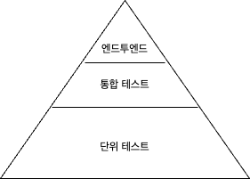

# 요약

## 좋은 단위 테스트의 4요소

좋은 단위 테스트에는 4가지 특성이 있다.

- 회귀 방지
- 리팩터링 내성
- 빠른 피드백
- 유지 보수성

해당 특성으로 단위테스트, 통합 테스트, 엔드투엔드 테스트를 모두 분석할 수 있다.

## 첫번째: 회귀 방지

회귀는 소프트웨어 버그이다.

회귀 방지 지표에 대한 테스트 점수가 얼마나 잘 나오는 평가하려면 아래 요소들을 고려할 수 있다.

- 테스트 대상 코드가 실행하는 코드의 양(= 테스트 커버리지)
    - 일반적으로 서비스에서 실행되는 코드가 많을수록 테스트에서 회귀가 나타날 확률이 높다.
    - 가능한 많은 코드를 실행하는 것을 목표로 해야 한다.
        - 많은 코드를 실행한다는 것은 해당 코드가 내재하고 있는 분기로 인한 모든 케이스를 검증해야함을 의미한다.
        - 여기에는 외부 라이브러리에 대한 검증도 있으면 그 효과는 극대화된다.
- 테스트 대상 코드의 복잡도
- 테스트 대상 코드의 도메인 근접성
    - 비즈니스에 중요한 기능에서 발생한 버그가 가장 큰 피해를 입힌다.

## 두번째: 리팩토링 내성

기존 테스트 코드가 실패로 바꾸지 않고 코드를 리팩토링할 수 있는지에 대한 척도이다

리팩토링은 식별할 수 있는 동작을 수정하지 않고 기존 코드를 변경하는 것이다.

리팩토링 내성이 낮은 경우 전체적인 기능 예전과 같이 동작하며, 오히려 더 개선되었지만, 기존의 테스트 코드가 실패하는 것이다.

이처럼 기능에 문제가 없지만, 오히려 테스트가 실패하는 것을 “거짓양성”이라고 한다.

리팩토링 내성 지표에서 테스트 점수가 얼마나 잘 나오나 평가하려면 얼마나 이 거짓양성이 발생하는 살펴봐야한다.

거짓양성을 없애나가야 하는 이유는 다음과 같다.

테스트를 통해 프로젝트의 지속가능한 성장을 가능하게 하려면 아래의 과정이 수반되는데 거짓양성은 이 과정에 치명적인 문제를 발생시킨다.

- 기존 기능이 고장나면 테스트 코드가 조기 경고를 제공한다.
    - 테스트가 타당한 이유없이 실패하면, 개발자는 테스트에 대한 신뢰를 잃는다. 따라서 테스트가 실패하여도 **회귀 가능성을 무시**한다.
- 테스트를 통해 코드의 변경이 회귀로 이어지지 않음을 확신할 수 있다.
    - 테스트에 대한 신뢰를 잃으면 **리팩토링을 주저**하게 된다. 해당 리팩토링으로 인한 회귀 정도를 알 수 없기 때문이다.

### 거짓양성의 원인

거짓양성은 왜 생겨나는 것일까? 거짓양성의 수는 테스트 구성 방식과 직접적인 연관이 있다.

테스트와 SUT의 세부 구현 사항이 결합할수록 거짓양성이 더 많이 발생한다.

해결법은 구현 세부 사항에서 테스트를 분리하는 것뿐이다.

**테스트는 최종사용자 관점에서 검증을 진행해야한다.**

테스트를 구성하기 가장 좋은 방법은 문제 영역에 대해 이야기하는 것이다.

즉, 검증하려는 스토리와 실제 애플리케이션 동작을 분리해야한다는 의미이다.

이러한 관점에서 작성된 테스트의 실패는 유일하게 테스트코드가 도움이 되는 유형이다.

다른 모든 실패는 중요한 것으로 부터 주의를 돌려버리는 소음일 뿐이다.

### 구현세부사항 대신 최종 결과를 목표로 해야한다

리팩토링 내성을 높이는 방법은 SUT의 구현 세부사항과 테스트 간의 결합도를 낮추는 것 뿐이다.

내부동작과 크게 결합하지 않아도 가짓양성은 발생할 수 있다.

바로 함수 시그니처를 변경하는 경우이다.

이 경우도 거짓양성이라고 볼 수 있지만, 그 질이 다르긴하다.

해당 경우는 컴파일 단계에서 문제점을 포착할 수 있어 빠른 수정이 가능하다. 문제는, 런타임에 식별가능한 거짓양성들이다. 이것들은 처리하기 까다롭다.

## 회귀 방지와 리팩토링 내성 간의 본질적 관계

프로젝트 초기의 경우 회귀 방지를 훌륭히 갖추는 것이 중요하다. 반면, 리팩토링 내성은 초기에는 크게 중요하지 않다.

### 테스트 정확도 극대화

기능과 테스트 결과는 아래와 같은 경우가 가능하다.

| 테스트 결과 / 기능 | 작동 | 실패 |
| --- | --- | --- |
| 성공 | 올바른 추론
(참 음성) | 2종 오류
(거짓 음성) |
| 실패 | 1종 오류
(거짓 양성) | 올바른 추론
(참양성) |

거짓 음성을 피하는 데 회귀 방지가 도움이 된다. (회귀 방지 → 2종 오류 피하기)

거짓 양성을 피하는 데 리팩토링 내성이 도움이 된다. (리팩토링 내성 → 1종 오류 피하기)

회귀 방지와 리팩토링 내성은 테스트 정확도를 극대화하는 것을 목표로 한다.

정확도 지표는 다음 두가지 요소로 구성된다.

- 테스트가 버그가 있음을 얼마나 잘 나타내는가? (거짓 음성을 없애기)
- 테스트가 버그가 없음을 얼마나 잘 나타내는가? (허위 경보인 거짓 양성을 없애기)

테스트 정확도를 식으로 표현하면 아래와 같이 표현할 수 있다.

$$
테스트 정확도 = \frac{신호(발견된 버그 수)}{소음(허위 경보 발생 수)}
$$

즉, 버그는 잡아내고 허위 경보는 없어야한다.

### 프로젝트 시기와 회귀 방지 그리고 리팩토링 내성

초기에는 회귀 방지가 중요하다. 왜냐하면, 개발자가 코드에 대한 식별률이 매우 높고 프로젝트 기능도 많지 않기 때문이다.

따라서 의도치 않은 버그를 빠르게 접할 수 있고 개발자는 작성한지 얼마되지 않은 코드를 빠르게 수정할 수 있다.

회귀 방지에 힘쓰는게 더 중요한 시점이다.

하지만, 회귀 방지만으로는 프로젝트의 성장을 유지할 수 없다.

일반적으로 리팩토링 내성을 고려할 만큼 프로젝트가 성장하지 않기에 대부분의 개발자는 이를 간과한다.

잘못된 경보보단, 눈에 띄지 않는 버그(회귀)에 총력을 가한다.

하지만 장기 프로젝트의 경우 **모든 리팩토링 작업을 방해하는 잘못된 경보는 반드시 바로잡아야한다.**

## 세, 네번째: 빠른 피드백과 유지 보수성

빠른 피드백이 중요한 이유는 테스트 속도가 빠를 수록 더 많이 더 자주 테스트를 수행할 수 있기 때문이다.

잦고 빠른 테스트는 결함이 생기자 마자 버그에 대해 대응할 수 있다.

유지보수성은 아래 두가지 요소로 구분된다.

- 테스트 코드가 얼마나 이해하기 어려운가?
    - 코드라인이 적을 수록 다른 개발자가 이해하기 쉽다.
    - AAA과정을 생략하지 않아야한다.
- 테스트가 얼마나 실행하기 어려운가?
    - 엔드투엔드 혹은 통합테스트를 진행할 경우 외부의존성을 사용할 수 있는데, 이 경우 외부의존성 세팅시의 어려움에 대해 평가할 수 있다.

## 이상적인 테스트를 찾아서

테스트의 가치는 앞서언급한 4가지 특성에 대한 평가의 곱으로 표현된다.

$$
테스트 가치 = 회귀 방지 * 리팩토링 내성 * 빠른 피드백 * 유지보수성
$$

정량적인 평가는 불가하기에 상대적인 지표로 사용할 수 있다.

테스트 가치를 네가지 요소의 곱으로 표현한 이유는 하나라도 0이되면 가치가 없기 때문이다.

### 이상적인 테스트는 가능한가?

회귀 방지, 리팩토링 내성, 빠른 피드백은 상호 배타적이라 셋중 둘에만 투자해야한다.

상호배타적인 이유를 사례를 통해 설명해보겠다.

- 사례1: 엔드투엔드 테스트의 경우
    - 많은 코드를 직접 실행함으로 회귀 방지가 잘된다.
        - 회귀 방지 +
    - 구현이 아닌 동작에 집중한 테스트임으로 리팩토링 내성은 고려하지 않는다.
        - 리팩토링 내성 +
    - 외부 의존성이 많아, 테스트가 느리다.
        - 빠른 피드백 -
- 사례2: 간단한 테스트(인스턴스 생성 및 생성자를 통해 전달한 프로퍼티 할당 테스트)
    - 너무 작은 테스트코드만 검증함으로 회귀 방지가 어렵다.
        - 회귀 방지 -
        - 회귀 방지성은 해당 테스트코드 고려하는 것이 아니라 시스템을 바라봐야한다.
    - 거짓 양성발생 가능성이 전무하다.
        - 리팩토링 내성 +
    - 누구보다 빠른 피드백이 가능하다.
        - 빠른 피드백 +
- **사례3: 깨지기 쉬운 테스트**
    - 실행이 빠르고 회귀를 잡을 가능성이 높지만, 거짓양성이 많은 테스트를 깨지기 쉬운 테스트라고 한다.
    - What보다는 How에 집중한 테스트로인해 잘 발생한다.
        - SQL문의 생성을 검증하는 테스트
            - What: 어떤 목적을 수행할 수 있는 쿼리
            - How: 구체적인 SQL구문(리팩토링 내성이 너무 낮다)

세 가지 특성 모두 완벽한 점수를 얻어서 이상적인 테스트를 만드는 것은 불가능하다.

어떤 특성도 0이 되지 않는 식으로 절충해야한다.

그러나 리팩토링 내성 만큼은 포기하면 안된다. 리팩토링 내성은 이진방식이다. 즉 하거나 안하거나 둘중하나를 나타낸다. 

리팩토링 내성이 0인 테스트는 가치가 없다, 오히려 방해만될 뿐이다.

## 대중적인 테스트 자동화 개념 살펴보기

### 테스트 피라미드 분해

테스트 피라미드는 테스트 스위트에서 테스트 유형 간의 일정한 비율을 의미한다.

층의 너비는 해당 테스트의 수에 따라 달라진다.

층의 높이는 해당 테스트가 얼마나 최종 사용자와 맞닿아 있는지를 의미한다.

엔드투 엔드 테스트수가 적어야 하는 이유는 빠른 피드백 지표 때문이다.

앞서 언급한 곱셈 규칙으로 인해 엔드투 엔드 테스트의 가치는 낮게 측정된다.

또한 리팩토링 내성이 결여되어 있지만, 관련된 애플리케이션 외부 의존성의 유지보수에 더 노력이 필요하다.

해당 외부 의존성에 대한 유지보수가 통합과 단위 테스트와 동일한 수준임이 지속적으로 보장되어야한다.

이러한 점을 고려했을 때 반드시 테스트가 필요한 부분이 아닌이상 지양해야한다.

간단한 프로그램일 경우 통합 테스트의 수가 단위 테스트 보다 많을 수 있어 피라미드가 직사각형이 될 수 있다.

간단한 로직의 경우 단위테스트의 필요성이 많이 줄어든다. 하지만 간단한 프로그램이라도 외부 의존성과의 연결(데이터 베이스 연결)은 여전히 중요함으로 통합테스트의 의미는 유지된다.

### 블랙박스 테스트 화이트박스 테스트

블랙박스 테스트는 시스템의 내부 구조를 몰라도 시스템의 기능을 검사할 수 있는 테스트 방법이다.

화이트 박스 테스트는 시스템의 내부 작업을 검증하는 테스트로, 구현과 테스트가 커플링된다.

화이트 박스 테스트의 경우 블랙박스보다 리팩토링 내성에서 낮은 점수를 받을 수 밖에 없다.

앞서 언급했듯 리팩토링 내성은 있거나 없거나 둘 중 하나이으로, **블랙박스 테스트를 지향하는 것이 올바르다**고 말할 수 있다.

일부 구현 사항에 대한 테스트가 중요한 유틸리티 로직의 경우 화이트 박스 테스트를 활용할 수 있다.

# 느낀점

테스트의 가치를 판단할 수 있는 기준틀을 학습한 장이었다.

평소에 테스트의 경우 “로직을 검증한다” 정도로 인식하였지만 거짓양성, 거짓음성등 테스트에서 고려해야 할 포인트를 명시적으로 알 수 있어서 좋았다.

작성한 테스트에 대한 리팩토링을 앞으로 조금씩 진행할 수 있을 것 같다.