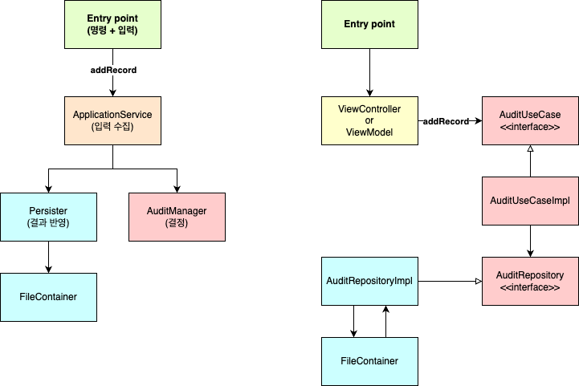

# 요약

단위 테스트의 3가지 스타일을 소개하고, 출력 기반 테스트가 가장 테스트하기 좋은 이유를 소개한다.

그리고 출력기반 테스트를 잘 구성하기 위한 함수형 프로그래밍 방식에 대해서도 설명한다.

## 단위 테스트의 3가지 스타일

출력 기반 테스트, 상태 기반 테스트, 통신 기반 테스트

### 출력 기반 테스트

테스트 대상 시스템에 입력을 넣고 생성되는 출력을 점검하는 방식이다.

해당 단위 테스트 스타일은 전역 상태나 내부 상태를 변경하지 않는 코드에만 즉, **순수함수 같은 코드에만 적용**할 수 있다.

### 상태 기반 스타일

작업이 완료된 이후 시스템 상태를 확인함으로써 테스트를 진행하는 스타일이다.

상태는, 시스템에 국한되지 않으며 데이터베이스나 파일 시스템과 같은 외부 의존성의 상태를 등을 의미할 수 있다.

작업의 완료가 함수의 결과 값과 무관하게 상태변화 즉, 사이드 이팩트를 발생시킴으로 출력 기반 테스트와는 근본적으로 성질이다르다.

### 통신 기반 스타일

이 스타일은 목 객체를 사용해 테스트 대상 시스템과 협력자 간의 통신을 검증한다.

두 분파는 모두 출력기반 테스트를 사용한다.

또한, 고전파는 통신 기반 스타일 보다 상태 기반 스타일을 선호한다. 

반면 런던파는 통신 기반 스타일을 선호한다.

## 테스트 스타일 비교

좋은 단위테스트를 판단할 수 있는 4가지 기준틀로 3가지 스타일을 비교해보자

- 회귀방지, 리팩토링 내성, 빠른 피드백, 유지 보수성

### 회귀 방지와 피드백 속도

회귀 방지 지표는 다음 세 가지 특성으로 결정

- 테스트 중에 실행되는 코드의 양
    - 코드가 많던 적든 원하는 대로 테스트를 작성할 수 있음으로 이 부분은 어떤 스타일도 별로 도움이 되지 못한다.
- 코드 복잡도
- 도메인 유의성
    - 이 2가지 특성도 마찬가지이다.

통신 기반 테스트는 너무 남용할 경우 테스트가 너무 피상적인 상태가 될 수 있다.

피상적이란, 본질보다 겉으로 들어나는 것에 너무 집착하는 것을 의미한다.

테스트 스타일과 테스트 피드백 속도 사이에는 명확한 상관관계가 없다. 세 스타일이 거의 동일하다.

### 리팩토링 내성

리팩토링 내성과 관련해서는 세가지 스타일마다 조금씩 그 정도가 다르다.

**리팩토링 내성은 리팩토링 중에 발생하는 거짓 양성 수에 대한 척도이다.**

거짓 양성은 식별할 수 있는 동작이 아니라 기능의 세부적인 구현 사항이 테스트와 얽혀 있는 경우 발생한다.

`출력기반 테스트 스타일`의 경우 테스트가 테스트 대상 매서드에만 결합됨으로 거짓 양성 방지가 매우 우수하다.

`상태 기반 테스트 스타일`은 일반적으로 거짓 양성이 되기 쉽다. 앞서 설명했듯, 작업의 호출로 변화되는 시스템의 상태를 점검함으로, 구현 세부사항과 테스트가 커플링될 가능성이 크기 때문이다.

통신 기반 테스트 스타일은 허위 경보에 가장 취약하다. 앞장에서 설명한 스텁과의 상호작용을 검증하는 경우가 발생할 수 있기 때문이다. 들어나는 동작을 확인하는 것에 집중해할 수 있도록 해야한다.

### 유지보수성

유지보수성 특성은 테스트 스타일에 영향을 많이 받다.

요지 보수성은 테스트의 유지비와 직결되는 문제로 판단하는 특성은 아래와 같다.

- 테스트를 얼마나 이해하기 어려운가?
- 테스트를 실행하기 얼마나 어려운가?

- **출력기반 테스트의 유지보수성**
    - 실행코드 및 검증 코드가 짧고 간결해 이해하기 쉽다.
    - 전역 상태 및 내부 상태를 변경 시키지 않음으로 외부 의존성이 불피요하다, 즉 별도의 외부 의존성을 다룰 필요가 없음으로 실행하기 쉽다.

- **상태 기반 테스트의 유지보수성**
    - 상태 기반 테스트는 종종 출력기반 테스트보다 많은 데이터를 검사해야 한다고 한다. 따라서 유지보수성이 출력 기반 테스트에 비해 상대적으로 떨어진다.

- **통신 기반 테스트의 유지 보수성**
    - 대역 설정에 많은 준비 코드가 필요하다.
    - mock이 많이 필요한 경우 테스트 하기 어렵다.
    - 따라서 앞선 2가지 스타일 보다 유지보수성이 낮다.

## 스타일 비교(결론)

출력 기반 테스트가 가장 이상적이다.

리팩토링 내성을 지키기 위한 노력이 상대적으로 덜 필요하고, 테스트를 위한 별도의 준비가 적음으로 유지비도 낮다. 즉, 유지 보수성이 높다.

## 함수형 아키테처 이해

### 함수형 프로그래밍

수학적 함수를 사용한 프로그래밍이다.

수학적 함수는 숨은 입출력이 없는 함수이다. 즉 사이드 이팩트를 발생시키지 않는다.

**수학적 함수의 모드 입출력은 함수의 시그니처에 들어난다. (매서드 이름, 인수, 반환 타입)**

숨은 입출력의 종류

- 사이드 이팩트
- 예외
    - 내부 호출 스택내에서 발생한 예외는 테스트 대상 매서드와 무관한 출력이 될 수 있다.
- 내외부 상태에 대한 참조

입출력을 명시한 수학적 함수는 이에 따르는 테스트가 짧고 간결하며 이해하고 유지보수하기 쉬워 테스트 역시 쉽다.

- 입출력이 모두 들어남으로 결과 및 동작을 함수호출만 봐도 예상할 수 있다.
- 사이드 이팩트가 없어 외부 의존성에 대한 관리가 불필요하다, 내부 시스템 코드에만 집중한다.

### 함수형 아키텍처

함수형 프로그래밍의 **목표는 사이드 이팩트의 제거가 아니다.**

**비즈니스 로직을 처리하는 코드와 사이드 이팩트를 일으키는 코드를 분리**하는 것이다.

사이드 이펙트와 비즈니스로직을 모두 고려하며 코드를 작성하기가 매우 힘들기 때문이다.

두 가지 코드 유형을 통해 분리를 이룰 수 있다.

- **결정을 내리는 코드**
    - 수학점 함수를 통해 작성
    - 함수형 코어라고 표현
- **해당 결정에 따라 작용하는 코드**
    - 수학정 함수를 통해 만들어진 모든 결정을 데이터베이스 저장 혹은 다른 형태로 시스템에 반영
    - 가변 셸이라고 표현

함수형 코어와 가변 셸은 다음과 같은 방법으로 협력한다.

1. 가변 셸은 함수형 코어에 필요한 입력을 수집
2. 함수형 코어는 입력을 기반으로 결정을 생성
3. 셸은 결정을 토대로 사이드 이펙트를 유발

<aside>

캡슐화와 불변성에 대해

캡슐화의 주된 기능중 하나는 객체 내부 상태를 노출시키지 않아 해당 상태가 모순이 생기는 상황을 방지하는 것이다.
함수형 프로그래밍에서는 해당 모순의 발생을 불변성이라는 특성을 통해 예방한다.
불변 상태는 변하지 않음으로, 상태 모순에 대한 문제를 예방한다.

</aside>

### 함수형과 헥사고날

도메인과 서비스 계층을 분리하는 헥사고날 아키텍처는 결정과 실행을 분리하는 함수형과 유사하다.

또한, 의존성의 방향이 항상 안쪽으로 향하는 것도 비슷하다.

둘의 결정적인 차이는 사이드 이팩트 처리에 있다.

헥사고날은 도메인 계층 내부에서 발생하는 사이드 이펙트에 대해선 제한을 두지 않는다.

함수형은 헥사고날로 치면 도메인에 해당하는 결정부분에 대해 엄격하게 사이드 이펙트를 허용하지 않는다.

<aside>

❓ 함수형 아키텍처는 헥사고날 보다 조금더 좁은 개념인 것 같다. 헥사고날의 도메인 계층의 일부에 함수형 아키텍처를 적용할 수 있는 그런 느낌인 것 같다.

</aside>

## 함수형 아키텍처의 한계

모든 테스트를 출력기반 테스트로 변경하는 것은 좋다. 하지만 현실적으로 힘들다.

그리고, 해당 변환 과정에서 함수형 아키텍처를 적용해야 하는데, 함수형 아키텍처에도 단점이 존재한다.

아키텍처를 지키기 위해 코드 베이스가 커질 수 있으며, `입력-결정-반영` 이라는 과정을 지켜야 함으로 성능적으로 손해가 발생할 수 있다.

(예를 들어 특정 과정의 사이드 이팩트를 없애기 위해 외부 환경에서 여러번 데이터베이스를 읽어야 하는 등)

따라서 저울질을 잘해야한다.

# 느낀점

테스트 스타일의 분류를 알 수 있었으며 각각의 용도와 앞장에서 배운틀을 기반으로 가치를 판단할 수 있었다.

함수형 프로그래밍 및 아키텍처에 대해서도 그 본질을 다시한번 살펴볼 수 있어서 좋았다.

함수형 아키텍처와 클린아키텍처를 한번 비교해보았다.

완쪽이 함수형 오른쪽이 클린아키텍처이다.

클린 아키텍처의 UseCase는 도메인 속하는 반면, ApplicationService는 함수형 아키텍처에서 도메인에 속하지 못한다.

반면, ApplicationService는 외부 리소스를 다루며, IO를 제어하거나 DB, 네트워크와 통신한다. 결정을 내리는 게 아니라 조율하는 역할에 가깝기 때문에 함수형 아키텍처에선 도메인이 아니다.

클린아키텍처는 “유저의 목적과 행위”에 집중한다. UseCase는 유저의 목적을 드러내고, 행위에 대한 구현을 제공함으로 클린아키텍처에 도메인으로 분류된다.

두 아키텍처가 주목하는 점이 다르기에 도메인역시 달라지는 것 같다.