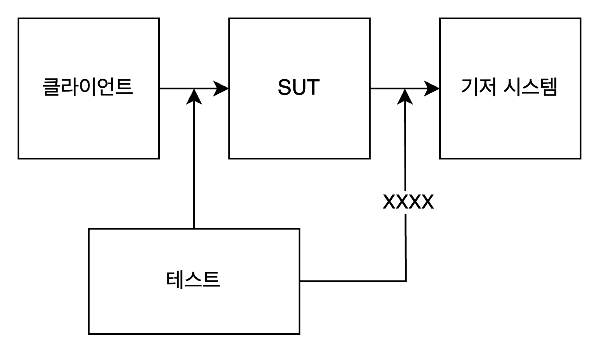

# 요약

앞장에서는 좋은 테스트를 판단하는 4가지 기준틀로 가치 있는 테스트를 판별하는 방법을 알아봤다. 하지만, 가치 있는 테스트를 알아보는 데 그치지 않고 **작성할 수도 있어야 한다.**

## 리팩터링할 코드 식별하기

기반코드를 리팩터링하지 않고서는 테스트 스위트를 크게 개선할 수 없다.

이번장에서는 코드의 4가지 분류를 통해 리팩터링 필요성을 설명한다.

모든 프로덕션 코드는 2차원으로 분류할 수 있다.

- `복잡도 또는 도메인 유의성`
- `협력자 수`

### 1️⃣ 복잡도 & 도메인 유의성

코드 복잡도는 코드 내 의사 결정(분기) 지점 수로 정의한다. 의사 결정 지점이 많을 수록 복잡한 코드로 분류된다.

<aside>

컴퓨터 사이언스 에서는 코드 복잡도를 나타내는 표현으로 순환 복잡도라는 개념을 사용한다.

해당 수치를 측정하는 방법은 아래와 같다.

**순환복잡도는 = 1 + <코드 분기점 수>**

해당 값을 통해 테스트 케이스의 수가 분기점의 수와 일치하는지 여부를 판단할 수 있다. 

※ 분기점은 가장작은 조건을 의미한다. IF의 조건문이 A && B라면 해당 조건문은 하나라도 분기점 2개로 판단된다.

</aside>

코드의 프로젝트의 문제 도메인에 얼마나 의미가 있는지를 나타낸다.

복잡한 코드와 도메인 유의성을 갖는 코드가 단위 테스트에서 가장 높은 가치를 가진다.

헤당 기준을 만족하는 코드를 테스트하면 회귀 방지력이 높다.

코드 복잡도와 도메인 유의성은 독립적인 개념이다.

### 2️⃣ 협력자의 수

협력자가 많은 코드는 테스트 비용이 많이 든다. 테스트시 협력자에 대한 추가적인 관리가 필요하기 때문이다.

2가지 분류사항을 표로 나타내면 코드 분류는 아래와 같은 4분면으로 분류된다.

|  | 협력자 적음 | 협력자 많음 |
| --- | --- | --- |
| 도메인 유의성 및 복잡도 높음 | Ex, 도메인 모델 및 비즈니스 알고리즘 | Ex, 지나치게 복잡한 코드 |
| 도메인 유의성 및 복잡도 낮음 | Ex, 간단한 코드 | Ex, 컨트롤러 |
- **컨트롤러:** 도메인 클래스와 외부 애플리케이션 같은 다른 구성 요소의 작업을 조장한다.
- **지나치게 복잡한 코드:** 협력자가 많으며 복잡하거나 중요하다. 모든 작업을 스스로 처리하는 컨트롤러가 여기에 속하게된다.

코드가 좌상단에 위치하게 된다면, 협력자 수가 적어 유지보수 비용이 적고 회귀방지성이 높아 가장 테스트하기 적합한 코드이다.

우상단 코드는 지나치게 복잡하거거나 도메인 유의성이 높아 테스트가 필요할 것이지만, 협력자가 많아 테스트 작성시 효율성이 크게 저하된다. 하지만, 그렇다고 방치할 수는 없다.

해당 영역에 속하는 코드는 리팩터링 대상으로, 도메인 혹은 알고리즘과 컨트롤러로 로직을 분리시켜야한다.

### 험블 객체 패턴으로 지나치게 복잡한 코드 리팩터링 하기

저자는 코드가 프레임워크 의존성에 결합돼 있기 때문에 테스트가 여렵다는 사실을 깨달았다고 한다.

프레임워크 의존성(테스트 하기 어려운 의존성)에는 아래와 같은 것들이 있다.

- 비동기 또는 멀티스레드 실행
- 사용자 인터페이스
- 프로세스 외부 의존성과의 통신

따라서 이러한 것들과 엮여있는 코드에서 테스트 가능한 부분을 덜어내야한다.


테스트 용이성을 위해서 험블 객체 패턴을 사용했지만, 해당 패턴은 SOLID의 단일 책임 패턴과고 관련이 있다.

익히 알려진 예로는, 비즈니스 로직과 오케스트레이션(조율)을 분리하는 것이다. 

이러한 분리가 필요한 이유는 테스트 용이성 뿐만아니라, 코드 복잡도를 낮출 수 있기 때문이다.

저자는 테스트 가능한 설계를 할 때, 테스트 용이성 뿐만아니라 코드의 유지보수성이 얼마나 증진 됬는지 역시 중요한 관점이라고 생각한다고 한다.

<aside>

험블 객체와 MVC, MVP

MVC, MVP의 컨트롤러와 프레젠터역시 시스템의 비즈니스 로직을 보유하는 모델 계층과 UI를 매개하는 역할을 한다는 점에서 조율과 비즈니스 로직을 분리하고 조율하는 험블 객체이다.

</aside>

## 가치 있는 단위 테스트를 위한 리팩터링

책에서 나온 CRM예저의 일부이다.

해당 매서드는 분기점이 적어 복잡한 코드는 아니지만, 매개변수로 들어나는 명시적 의존성 2개와 내부적으로 숨겨진 의존성 2개가 존재한다.

매개변수의 경우 값이기 때문에 협력자라고 볼 수 없다, 하지만 DataBase, MessageBus의 경우 값이 아닌 외부 협력자이다. 도메인과 관련된 코드는 외부 의존성을 직접적으로 의존하면 안된다는 점과 협력자의 수가 많다는 점에서 해당 코드는 지나치게 복잡한 코드로 분류된다.

```swift
class User {
    
    func changeEmail(userId: Int, email: String) {
        
        DataBase. ...
        
        MessageBus. ...
    }
}
```

해당 코드는 단순한 프로젝트에서는 문제가 없을 수 있다. 하지만, 프로젝트 규모가 커질 수록 확장성이 크게 떨어지는 문제가 발생한다. SOLID원칙중 단일책임 원칙이 지켜지지 않기 때문이다.

데이터 저장, 로직 처리, 이메일 전송 등 다중 책임?이 있으며, 변경의 이유가 1가지 이상이다.

### 1단계: 암시적 의존성을 명시적으로 바꾸기

암시적 의존성을 명시적으로 바꾸는 것은 테스트 과정에서 해당 객체를 대역으로 교체하여 테스트를 할 수 있다는 점에서 유용하다.

하지만, 이를 위해선 복잡한 Mock체계가 요구되어 유지 보수 비용이 높아지는 경향도 무시할 수 없다.

따라서 가능하면 도메인 로직과 외부 의존성은 완전히 분리시키는 것이 좋다.

### 2단계: 조율자 계층 도입

도메인 모델이 직접적이던 간접적이던 외부 의존성에 의존하는 것을 피하려면, 둘 사이를 매개할 수 있는 조율자가 필요하다.

하지만, 무작정 외부 의존성을 컨트롤러(조율자)로 이동시키면 컨트롤러 복잡도가 너무 올라갈 수 있다.

예를들어 여러가지 엣지 케이스들에 대응해야 하는 로직들이 컨트롤러에 그대로 작성될 수 있기 때문이다.

- **도메인:**
    - 이메일 변경
- **컨트롤러:**
    - 디비로 부터 획득한 데이터 모델을 도메인 모델로 변경(ORM)
    - 변경된 이메일 저장
    - 이메일이 이전과 다른 경우 메일 전송
    - ….

### 3단계: 컨트롤러 복잡도 낮추기

- ORM로직을 별도의 팩토리 객체로 추출하기

```swift
class User {
    
    func changeEmail(userId: Int, email: String, numberOfEmployees: Int) -> Int {
        
        return ...
    }
}
```

현재 책의 수정된 예시 코드는 이메일 업데이트시 현재 회사 이메일을 사용하는 유저의 수를 반환한다.

이 플로우는 매우 어색하다.

Company객체를 따로 만들고, 회사 데이터와 관련된 작업을 캡슐화할 필요가 있다.

```swift
class User {
    
    func changeEmail(userId: Int, email: String, company: Company) {
        
        company.setNumberOfEmployees(100)
    }
}

class Company {
    private var numberOfEmplaoyees: Int
    
    func setNumberOfEmployees(_ numberOfEmployees: Int) {
        ...
    }
}
```

해당 구현은 도메인 매서드의 호출이 사이드 이팩트를 유발하지만, 모든 사이드 이팩트가 도메인 레이어 내부에 머무른다.

외부 의존성이 아니기에 사이드 이팩트를 관리하기 위한 비용이 적고, 상태 기반 테스트로 충분히 검증할 수 있다.

## 최적의 단위 테스트 커버리지 분석

비즈니스 로직과 오케스트레이션을 분리하면, 해당 코드가 사분면 어디에 속하는지 파악할 수 있고 테스트 필요성을 판단할 수 있게된다. (우상단의 코드를 적절하게 다른 분면으로 이동시키는 것이 핵심이다.)

### 전제 조건을 테스트 해야하는가?

예를들어 “회사의 인원수가 음수가 되지 말아야 한다” 같은 전제조건이 있다.

해당 코드가 도메인 유의성이 있는 경우 테스트하는게 좋다.

도메인 유의성이 없는 제약에 대한 테스트는 시간 낭비이다.

## 컨트롤러에서 조건부 로직처리

비즈니스 로직과 오케스트레이션을 분리할 때 아래와 같은 세단계의 프로세스를 가지면 가장 효과적인 분리가 된다.

1. 저장소에서 데이터 획득
2. 해당 데이터에 연산 적용하여 결과 도출
3. 비즈니스 로직의 결과를 다시 저장소에 저장

하지만, 중간 결과에 따라 새로운 데이터를 요청하는 등 위와 같이 3단계로 구성되지 않는 경우도 많다.

이러한 상황에서는 아래 3가지 방법을 사용할 수 있다.

**방법1: 어쨌든 외부에 대한 읽기 쓰기를 비즈니스 로직으로 부터 가장 멀리 위치시킨다.** 

- 단점
    
    이방 법은 앞서 언급한 3단계에서 효율적으로 동작하지만, 성능이 감소될 수 있다.(도메인 중간결과에 따른 불필요한 데이터 획득 및 쓰기과정을 막을 수 없음으로)
    

**방법2: 도메인 모델에 외부 의존성을 주입한다. (간접 의존 방식)**

- 단점
    
    해당 로직의 협력자 수 증가로, 앞서 언급한 것처럼 Mock객체 관리등 추가적인 비용발생
    

**방법3: 의사 결정 프로세스 단계를 더 세분화하고, 각 단계별로 컨트롤러를 실행한다.**

- 단점
    
    컨트롤러가 다소 복잡해진다. 컨트롤러 내부에 의사 결정과 관련된 코드가 필요해진다.
    

3가지 특성을 적절하게 만족시키는 것이 중요하다. 3가지 특성을 모두 충족시키는 방법은 없기 때문에, 세가지중 2가지를 선택해야한다.

- 도메인 모델 테스트 유의성
- 컨트롤러의 단순성
- 성능

대부분의 소프트웨어는 성능이 가장 중요하기에 방법1은 배제한다.

방법2는 대부분 지나치게 복잡한 코드를 낳음으로 배제한다.

방법3은 컨트롤러를 복잡하게 만들어 해당 코드를 지나치게 복잡한 사분면에 위치시키게 된다.

책에서는 다른 방법을 소개한다, 아래서 부터 시작한다.

### CanExecute, Execute패턴 사용하기

해당 패턴은 비즈니스 로직이 컨트롤러로 유출되는 것을 막는다.

해당 패턴의 사용예시를 들기 위해 기존 코드의 문제점을 먼저 보여주겠다.

아래 코드는 이메일 변경의 성공 여부와 무관하게 디비 저장이 실행된다. 디비 저장 뿐만아니라 여러 불필요한 로직이 중간단계와 무관하게 실행될 수 있다.

```swift
class UserController {
    func someTask() {
        
        let user = User()
        
        user.changeEmail(userId: 12, email: "sdasd@")
        
        // DB저장로직
    }
}

class User {
    
		private var isEmailConfirmed: Bool = false
    
    func changeEmail(userId: Int, email: String) {
        
        if isEmailConfirmed {
            // ...
        }
    }
}

```

의사 결정 코드를 컨트롤러로 이동시켜 성능을 증진시켜보자.

확실히 불필요한 코드의 실행을 막음으로써 성능은 증진되었다.

하지만, 도메인 모델의 세부 상태가 외부로 노출됨으로 유지보수가 힘든 코드가 된다. “묻지 말고 시켜라”에 반하는 코드이다.

```swift
class UserController {
    func someTask() {
        
        let user = User()
        
        if user.isEmailConfirmed == false {
            return
        }
        
        user.changeEmail(userId: 12, email: "sdasd@")
        
        // DB저장
    }
}

class User {
    
    var isEmailConfirmed: Bool = false
    
    func changeEmail(userId: Int, email: String) {
    }
}
```

canExecute패턴을 도입하면 코드가 아래와 같이 변한다.

의사결정은 도메인 모델이, 중간단계에 대한 분기처를 통해 컨트롤러는 성능을 높인다, 그리고 도메인 세부사항을 노출시키지 않고 특정 중간 프로세스의 처리 가능성만을 노출한다.

```swift
class UserController {
    func someTask() {
        
        let user = User()
        
        if user.canChangeEmail() == false {
            return
        }
        
        user.changeEmail(userId: 12, email: "sdasd@")
        
        // DB저장
    }
}

class User {
    
    private var isEmailConfirmed: Bool = false
    
    func canChangeEmail() -> Bool {
        isEmailConfirmed
    }
    
    func changeEmail(userId: Int, email: String) {
    }
}
```

해당 패턴의 장점은 컨트롤러는 의사 결정을 내리지 않음으로 테스트가 불필요해진다.

도메인 로직에 집중적으로 테스트를 진행하면된다.

### 도메인 이벤트

그런데 조금더 자세한 정보를 알리고 싶은 경우가 있을 수 있다.

예를 들어 “변경 예정인 이메일이 이전과 같으면 메일을 보내지 마세요”와 같은 조건을 canExecute패턴을 적용하기엔 한계가 있다.

이러한 경우 도메인 이벤트라는 것을 활용할 수 있다.

도메인 이벤트는 비즈니스 연산이 완료된 후 해당 변경 사항을 프로세스 외부 의존성 호출로 변환한다.

물론 컨트롤러에서 새로운 이메일과 이전 이메일을 간단하게 비교함으로써 해당 문제는 해결할 수 있지만, 도메인 로직인 “이메일이 같으면 이메일을 보내지 않음”이 컨트롤러에 위치하게 된다. 이러한 현상을 도메인 파편화라고 하며, 유지보수하기 힘든 코드를 유발한다.

가장 간단하게 해결하는 것은 도메인 이벤트 방식 뿐이다.

따라서 User에 도메인 이벤트를 획득할 수 있는 인터페이스를 만들고, 해당 인터페이스를 사용하여 “이메일 변화”라는 도메인 이벤트가 발생했는지를 컨트롤러는 확인하고, 이메일 전송을 결정한다.

이를 통해 “이전 이메일과 최근 이메일이 서로달라 이메일이 변경되었음”이라는 비즈니스 로직에 의한 의사 결정이 User로 한정될 수 있게 된다.

컨트롤러는 단지 해당 결과를 바탕으로 이후 사이드 이팩트를 유발한다.

## 결론

이번장의 핵심은, 외부의존성에 대한 애플리케이션 내부에서 발생하는 사이드 이팩트를 추상화 하는 것이다.

- 이메일이 정말로 변경되었는가?
- 이메일이 변경 가능한 상태인가?

해당 내역들을 CanExecute패턴과 도메인 이벤트 등으로 추상화 할 수 있었다.

도메인 객체가 외부의존성이 없다면, 도저히 수행할 수 없는 작업들도 존재한다.

예를들어 이메일의 고유성을 감지하려면, 데이터베이스 조회가 필요하다.

이러한 경우 컨트롤러에서 해당 검사를 하게할 수 있다. 도메인 로직(이메일 고유성)이 파편화 되지만, 오케스트레이션과 도메인 로직을 분리하는 것이 테스트하기 수월하다는 점에서 이점이 더크다.

**이 것역시 트레이드 오프에 의한 선택이된다.**

컨트롤러가 비즈니스 로직을 보유할 수 있는 것처럼, 도메인 클래스가 모든 협력자를 제거하는 경우역시 쉽지않다.

하지만, 해당 협력자가 프로세스 외부 의존성이 아니라면, 지나치게 복잡한 코드는 아닐 것이다.

이러한 내부 협력자간 상호작용을 목을 통해 테스트하지 않도록 주의해야한다. 세부사항에 해당하기 때문이다.

매서드가 클래스의 식별할 수 있는 동작인지 여부는 클라이언트가 누구인가와 클라이언트의 목표가 무엇인가에 따라 결정되는 것이다.

식별할 수 있는 동작이려면 아래 두개중 하나를 만족해야한다.

- 클라이언트의 목표와 직접적인 연관이 있음
- 외부 애플리케이션의 사이드 이팩트를 유발함(이벤트 전송 등)

클라이언트는 상대적인 개념이다. 각계층간의 상호작용 테스트하되, 기저 계층과 어떻게 통신하는지는 무시해야한다.



# 느낀점

테스트를 4가지 사분면으로 분류하고 어떤 코드를 대상으로 테스트해야 최대 효율을 발휘할 수 있을 지 알수 있었다.

뿐만아니라 지나치게 복잡한 코드를 책임 분리를 통해 테스트 효율을 극대화할 수 있는 리팩토링 방법에 대해서도 알 수 있었다.